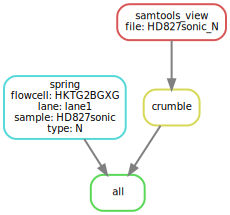

# :snake: hydra-genetics/compression

#### Snakemake module containing steps to minimize big files prior to storage


[](https://opensource.org/licenses/gpl-3.0.html)

## :speech_balloon: Introduction

The module contains rules to compress big data files prior to storage. `.fastq`-files should be compressed using
`spring` which can save up to 80% storage space. For `.bam`-files, `.crumble.cram` compression is the weapon of
choice. Alignment `.bam`-files can be generated with `hydra-genetics/alignment` or `hydra-genetics/parabricks`
making for a smooth transition. Input data should be specified via `samples.tsv` and `units.tsv`.

## :heavy_exclamation_mark: Dependencies

In order to use this module, the following dependencies are required:

[](https://github.com/hydra-genetics/)
[](https://pandas.pydata.org/)
[](https://www.python.org/)
[](https://snakemake.readthedocs.io/en/stable/)
[](https://sylabs.io/docs/)

## :school_satchel: Preparations

### Sample and unit data

Input data should be added to [`samples.tsv`](https://github.com/hydra-genetics/compression/blob/develop/config/samples.tsv)
and [`units.tsv`](https://github.com/hydra-genetics/compression/blob/develop/config/units.tsv).
The following information need to be added to these files:

| Column Id | Description |
| --- | --- |
| **`samples.tsv`** |
| sample | unique sample/patient id, one per row |
| tumor_content | ratio of tumor cells to total cells |
| **`units.tsv`** |
| sample | same sample/patient id as in `samples.tsv` |
| type | data type identifier (one letter), can be one of **T**umor, **N**ormal, **R**NA |
| platform | type of sequencing platform, e.g. `NovaSeq` |
| machine | specific machine id, e.g. NovaSeq instruments have `@Axxxxx` |
| flowcell | identifer of flowcell used |
| lane | flowcell lane number |
| barcode | sequence library barcode/index, connect forward and reverse indices by `+`, e.g. `ATGC+ATGC` |
| fastq1/2 | absolute path to forward and reverse reads |
| adapter | adapter sequences to be trimmed, separated by comma |

### Reference data

A reference `.fasta`-file should be specified in `config.yaml` in the section `reference` and `fasta`.

## :white_check_mark: Testing

The workflow repository contains a small test dataset `.tests/integration` which can be run like so:

```bash
$ cd .tests/integration
$ snakemake -s ../../Snakefile -j1 --use-singularity
```

## :rocket: Usage

To use this module in your workflow, follow the description in the
[snakemake docs](https://snakemake.readthedocs.io/en/stable/snakefiles/modularization.html#modules).
Add the module to your `Snakefile` like so:

```bash
module compression:
    snakefile:
        github(
            "hydra-genetics/compression",
            path="workflow/Snakefile",
            tag="v0.1.0",
        )
    config:
        config


use rule * from compression as compression_*
```

### Compatibility

Latest:
 - alignment:v0.1.0

 See [COMPATIBLITY.md](../master/COMPATIBLITY.md) file for a complete list of module compatibility.

### Output files

The following output files should be targeted via another rule:

| File | Description |
|---|---|
| `compression/crumble/{file}.crumble.cram` | `crumble`-compressed `.cram` alignment files |
| `compression/spring/{sample}_{flowcell}_{lane}_{barcode}_{type}.spring` | `spring`-compressed `.fastq` read file pair |

## :judge: Rule Graph


